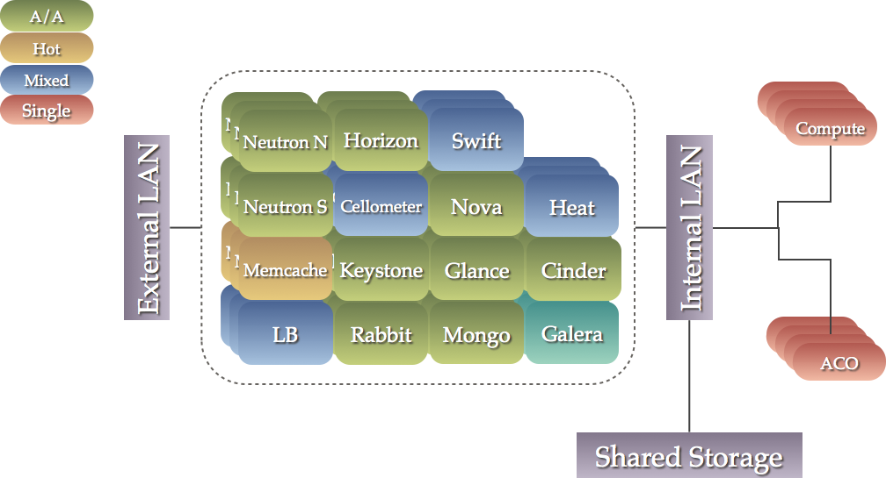

# Highly Available Openstack Deployments

Looking for the Juno (RDO6) edition?
Check out the [Juno-RDO6 branch](../Juno-RDO6/ha-openstack.md)
instead.

The current target for this document is pre-release RDO 7, based on
the OpenStack Kilo release.

## Purpose of this Document

This document aims at defining a high level architecture for a highly
available RHEL OSP setup with the [Pacemaker](http://clusterlabs.org)
cluster manager which provides:

- detection and recovery of machine and application-level failures
- startup/shutdown ordering between applications
- preferences for other applications that must/must-not run on the same machine
- provably correct response to any failure or cluster state

It is important to understand the following definitions used to
describe the operational mode of services in a cluster:

- Active/active 

  Traffic intended for the failed node is either passed onto an
  existing node or load balanced across the remaining nodes. This is
  usually only possible when the nodes use a homogeneous software
  configuration.

- Active/passive

  Provides a fully redundant instance of each node, which is only
  brought online when its associated primary node fails. This
  configuration typically requires the most extra hardware.

In this document, all components are currently modelled as
active/active with the exception of:

- openstack-heat-engine 
- cinder-volume
- qpid (optional)

Implementation details are contained in scripts linked to from the main document.
Read them carefully before considering to run them in your own environment. 

## Disclaimer 

- The referenced scripts contain many comments and warnings - READ THEM CAREFULLY.
- There are probably 2^8 other ways to deploy this same scenario. This is only one of them.
- Due to limited number of available physical LAN connections in the test setup, the instance IP traffic overlaps with the internal/management network.
- Distributed/Shared storage is provided via NFS from the commodity server due to lack of dedicated CEPH servers. Any other kind of storage supported by OpenStack would work just fine.
- Bare metal could be used in place of any or all guests.
- Most of the scripts contain shell expansion to automatically fill in some values.  Use your common sense when parsing data. Example:

  `openstack-config --set /etc/nova/nova.conf DEFAULT vncserver_proxyclient_address $(ip addr show dev vmnet0 scope global | grep inet | sed -e 's#.*inet ##g' -e    's#/.*##g')`

  means that we want the IP address from vmnet0 as vncserver_proxyclient_address.

## Bugs

- **python-tooz 0.13.2** or later is required (https://bugzilla.redhat.com/show_bug.cgi?id=1203706).
- **python-websockify 0.6.0** or later is required (https://bugzilla.redhat.com/show_bug.cgi?id=1200701).

These should be fixed by the Kilo GA date.

### TODO

- Missing how-to move a service from cluster X to cluster Y
- nova network HA
- Compute nodes managed by pacemaker_remoted
- Remove all artificial sleep and use pcs --wait once 7.1 is out of the door
- Improve nova-compute test section with CLI commands
- re-check keystone -> other services start order require-all=false option
- Variables for *_passwd

# Hardware / VM deployment

## Requirements

A minimum of 5 machines are required to deploy this setup:

- 1 commodity server (can be a VM) to deploy nfs-server, dhcp, dns
- 1 bare metal node to be used a compute node
- 3 controller nodes

  The linked scripts assume the controller nodes are bare-metal and will create one or more VMs (dependng on the deployment type) to run on top of them.
  You could equally just use the bare metal directly.

## Assumptions

- To provide additional isolation, every component runs in its own virtual machine
- All APIs are exposed only in the internal LAN
- neutron-agents are directly connected to the external LAN
- nova and horizon are exposed to the external LAN via an extra haproxy instance
- Compute nodes have a management connection to the external LAN but it is not used by OpenStack and hence not reproduced in the diagram. This will be used when adding nova network setup.
- Here is a [list of variables](pcmk/ha-collapsed.variables) used when executing the referenced scripts.  Modify them to your needs.

In this document we describe two deployment extremes:

1.  __Segregated__
    
    In this configuration, each service runs in a dedicated cluster of
    3 or more nodes.
    
    The benefits to this approach are the physical isolation between
    components and the ability to add capacity to specific components.

    This scenario can be visualized as below, where each box below
    represents a cluster of three or more guests. 
    
    

1.  __Collapsed__ 
    
    In this configuration, there is a single cluster of 3 or more
    nodes on which every component is running.
    
    This scenario has the advantage of requiring far fewer, if more
    powerful, machines.  Additionally, being part of a single cluster
    allows us to accurately model the ordering dependancies between
    components.

    This scenario can be visualized as below. 
    
    

1.  __Mixed__ (not documented) 

    While not something we document here, it is certainly possible to
    follow a segregated approach for one or more components that are
    expected to be a bottleneck and use a collapsed apprach for the
    remainder.

Regardless of which scenario you choose, it is required that the
clusters contain at least three nodes so that we take advantage of
[quorum](http://en.wikipedia.org/wiki/Quorum_(Distributed_Systems))

Quorum becomes important when a failure causes the cluster to split in
two or more paritions.  In this situation, you want the majority to
ensure the minority are truely dead (through fencing) and continue to
host resources.  For a two-node cluster, no side has the majority and
you can end up in a situations where both sides fence each other, or
both sides are running the same services - leading to data corruption.

Clusters with an even number of hosts suffer from similar issues - a
single network failure could easily cause a N:N split where neither
side retains a majority.  For this reason, we recommend an odd number
of cluster members when scaling up.

You can have up to 16 cluster members (this is currently limited by
corosync's ability to scale higher).  In extreme cases, 32 and even up
to 64 nodes could be possible however this is not well tested.

In some environments, the available IP address range of the public LAN
is limited. If this applies to you, you will need one additional node
to set up as a [gateway](pcmk/gateway.scenario) that will provide DNS
and DHCP for the guests containing the OpenStack services and expose
the required nova and horizon APIs to the external network.

## Implementation - Segregated

Start by creating a minimal CentOS installation on at least three nodes.
No OpenStack services or HA will be running here.

For each service we create a virtual cluster, with one member running
on each of the physical hosts.  Each virtual cluster must contain at
members, one per physical host, for the reasons stated above.

Once the machines have been installed, [prepare them](pcmk/baremetal.scenario) 
for hosting OpenStack.

Next we must [create the image](pcmk/virt-hosts.scenario) for the
guests that will host the OpenStack services and clone it.  Once the
image has been created, we can prepare the hosting nodes and
[clone](pcmk/virt-hosts.scenario) it.

## Implementation - Collapsed

Start by creating a minimal CentOS installation on at least three nodes.
No OpenStack services or HA will be running here.

We create a single virtual cluster, with one member running on each of
the physical hosts.  The virtual cluster must contain at least three
members, one per physical host, for the reasons stated above.

Once the machines have been installed, [prepare them](pcmk/baremetal.scenario) 
for hosting OpenStack.

Next we must [create the image](pcmk/virt-hosts.scenario) for the
guests that will host the OpenStack services and clone it.  Once the
image has been created, we can prepare the hosting nodes and
[clone](pcmk/virt-hosts.scenario) it.

# Deploy OpenStack HA controllers

This how-to is divided in 2 sections. The first section is used to
deploy all core non-OpenStack services, the second section all
OpenStack services.

Pacemaker is used to drive all services.

## Installing core non-Openstack services

### Cluster Manager

At its core, a cluster is a distributed finite state machine capable
of co-ordinating the startup and recovery of inter-related services
across a set of machines.

Even a distributed and/or replicated application that is able to
survive failures on one or more machines can benefit from a
cluster manager:

1.  Awareness of other applications in the stack
    
    While SYS-V init replacements like systemd can provide
    deterministic recovery of a complex stack of services, the
    recovery is limited to one machine and lacks the context of what
    is happening on other machines - context that is crucial to
    determine the difference between a local failure, clean startup
    and recovery after a total site failure.

1.  Awareness of instances on other machines

    Services like RabbitMQ and Galera have complicated boot-up
    sequences that require co-ordination, and often serialization, of
    startup operations across all machines in the cluster. This is
    especially true after site-wide failure or shutdown where we must
    first determine the last machine to be active.
    
1.  A shared implementation and calculation of [quorum](http://en.wikipedia.org/wiki/Quorum_%28Distributed_Systems%29)

    It is very important that all members of the system share the same
    view of who their peers are and whether or not they are in the
    majority.  Failure to do this leads very quickly to an internal
    [split-brain](https://en.wikipedia.org/wiki/Split-brain_(computing))
    state - where different parts of the system are pulling in
    different and incompatioble directions.

1.  Data integrity through fencing (a non-responsive process does not imply it is not doing anything)

    A single application does not have sufficient context to know the
    difference between failure of a machine and failure of the
    applcation on a machine.  The usual practice is to assume the
    machine is dead and carry on, however this is highly risky - a
    rogue process or machine could still be responding to requests and
    generally causing havoc.  The safer approach is to make use of
    remotely accessible power switches and/or network switches and SAN
    controllers to fence (isolate) the machine before continuing.

1.  Automated recovery of failed instances
    
    While the application can still run after the failure of several
    instances, it may not have sufficient capacity to serve the
    required volume of requests.  A cluster can automatically recover
    failed instances to prevent additional load induced failures.

For this reason, the use of a cluster manager like
[Pacemaker](http://clusterlabs.org) is highly recommended.  The [basic
cluster setup](pcmk/basic-cluster.scenario) instructions are required for
every cluster.

When performing an collapsed deployment, there is only one cluster
and now is the time to follow the [basic cluster setup](pcmk/basic-cluster.scenario)
instructions.

When performing an segregated deployment, this step will need to be
performed before configuring each component.

### Proxy server

Almost all services in this stack are proxied.
Using a proxy server provides:

1.  Load distribution
    
    Many services can act in an active/active capacity, however they
    usually require an external mechanism for distributing requests to
    one of the available instances. The proxy server can serve this
    role.

1.  API isolation
    
    By sending all API access through the proxy, we can clearly
    identify service interdependancies.  We can also move them to
    locations other than `localhost` to increase capacity if the need
    arises.

1.  Simplified process for adding/removing of nodes
    
    Since all API access is directed to the proxy, adding or removing
    nodes has no impact on the configuration of other services.  This
    can be very useful in upgrade scenarios where an entirely new set
    of machines can be configured and tested in isolation before
    telling the proxy to direct traffic there instead.

1.  Enhanced failure detection

    The proxy can be configured as a secondary mechanism for detecting
    service failures.  It can even be configured to look for nodes in
    a degraded state (such as being 'too far' behind in the
    replication) and take them out of circulation.

The following components are currently unable to benefit from the use
of a proxy server:

- RabbitMQ
- memcached
- mongodb

However the reasons vary and are discussed under each component's
heading.

We recommend HAProxy as the load balancer, however there are many
alternatives in the marketplace.

We use a check interval of 1 second however the timeouts vary by service.

Generally we use round-robin to distriute load amongst instances of
active/active services, however Galera and Qpid use the `stick-table`
options to ensure that incoming connections to the virtual IP (VIP)
should be directed to only one of the available backends.

In Galera's case, although it can run active/active, this helps avoid
lock contention and prevent deadlocks.  It is used in combination with
the `httpchk` option that ensures only nodes that are in sync with its
peers are allowed to handle requests.

Qpid however operates in a active/passive configuration, no built-in
clustering, so in it's case the `stick-table` option ensures that all
requests go to the active instance.

If you are performing a segregated deployment, follow the [basic
cluster setup](pcmk/basic-cluster.scenario) instructions.

After verifying the (collapsed or newly created) cluster is
functional, you can then deploy the [load balancer](pcmk/lb.scenario) to
the previously created guests.

### Replicated Database

Most OpenStack components require access to a database.

To avoid the database being a single point of failure, we require that
it be replicated and the ability to support multiple masters can help
when trying to scale other components.

One of the most popular database choices is Galera for MySQL, it supports:

- Synchronous replication
- active/active multi-master topology
- Automatic node joining
- True parallel replication, on row level
- Direct client connections, native MySQL look & feel

and claims:

- No slave lag
- No lost transactions
- Both read and write scalability
- Smaller client latencies

Although galera supports active/active configurations, we recommend
active/passive (enforced by the load balancer) in order to avoid lock
contention.

If you are performing a segregated deployment, follow the [basic
cluster setup](pcmk/basic-cluster.scenario) instructions to set up a
cluster on the guests intended to contain `Galera`.

After verifying the (collapsed or newly created) cluster is
functional, you can then [deploy galera](pcmk/galera.scenario) into it.

To verify the installation was successful, perform the following [test
actions](pcmk/galera-test.sh) from one of the nodes.

### Database Cache

Memcached is a general-purpose distributed memory caching system. It
is used to speed up dynamic database-driven websites by caching data
and objects in RAM to reduce the number of times an external data
source must be read.

__Note__: Access to memcached is not handled by HAproxy because
replicated access is currently only in an experimental state.  Instead
consumers must be supplied with the full list of hosts running
memcached.

If you are performing a segregated deployment, follow the [basic
cluster setup](pcmk/basic-cluster.scenario) instructions to set up a
cluster on the guests intended to contain `memcached`.

After verifying the (collapsed or newly created) cluster is
functional, you can then [deploy memcached](pcmk/memcached.scenario) into
it.

### Message Bus

An AMQP (Advanced Message Queuing Protocol) compliant message bus is
required for most OpenStack components in order to co-ordinate the
execution of jobs entered into the system.

RabbitMQ and Qpid are common deployment options. Both support:

- reliable message delivery
- flexible routing options
- replicated queues

This guide assumes RabbitMQ is being deployed, however we also
[document Qpid (TODO)](pcmk/osp-qpid.scenario) for completeness.  Pay
attention to the comments in that guide for how selecting `Qpid` affects
the rest of the configuration.

__Note__: Access to RabbitMQ is not handled by HAproxy.  Instead
consumers must be supplied with the full list of hosts running
RabbitMQ with `rabbit_hosts` and `rabbit_ha_queues` options.

Jock Eck found the [core
issue](http://people.redhat.com/jeckersb/private/vip-failover-tcp-persist.html)
and went into some detail regarding the [history and
solution](http://john.eckersberg.com/improving-ha-failures-with-tcp-timeouts.html)
on his blog.

In summary though:

> The source address for the connection from HAProxy back to the
> client is the VIP address. However the VIP address is no longer
> present on the host. This means that the network (IP) layer deems
> the packet unroutable, and informs the transport (TCP) layer. TCP,
> however, is a reliable transport. It knows how to handle transient
> errors and will retry. And so it does.

In this case that is a problem though, because:

> TCP generally holds on to hope for a long time. A ballpark estimate
> is somewhere on the order of tens of minutes (30 minutes is commonly
> referenced). During this time it will keep probing and trying to
> deliver the data.
>
> It's important to note that HAProxy has no idea that any of this is
> happening. As far as its process is concerned, it called write()
> with the data and the kernel returned success.

The [resolution](https://review.openstack.org/#/c/146047/) is already
understood and just needs to make its way through review.

If you are performing a segregated deployment, follow the [basic
cluster setup](pcmk/basic-cluster.scenario) instructions to set up a
cluster on the guests intended to contain `RabbitMQ`.

After verifying the (collapsed or newly created) cluster is
functional, you can then deploy [rabbitmq](pcmk/rabbitmq.scenario) into it.

To verify the installation was successful, perform the following [test
actions](pcmk/rabbitmq-test.sh) from one of the nodes.

### NoSQL Database (optional)

If you plan to install `ceilometer` or `heat`, you will need a NoSQL
database such as mongodb.

MongoDB is a cross-platform document-oriented database that eschews
the traditional table-based relational database structure in favor of
JSON-like documents with dynamic schemas, making the integration of
data in certain types of applications easier and faster.

__Note__: Access to mongodb is not handled by HAproxy [because TODO].
Instead ceilometer must be supplied with the full list of hosts running mongodb.

If you are performing a segregated deployment, follow the [basic
cluster setup](pcmk/basic-cluster.scenario) instructions to set up a
cluster on the guests intended to contain `mongodb`.

After verifying the (collapsed or newly created) cluster is
functional, you can then [deploy mongodb](pcmk/mongodb.scenario) into it.

## Installing Openstack services
### Keystone

Keystone is an OpenStack project that provides Identity, Token,
Catalog and Policy services for use specifically by projects in the
OpenStack family. It implements OpenStack's Identity API and acts as a
common authentication system across the cloud operating system and can
integrate with existing backend directory services.

If you are performing a segregated deployment, follow the [basic
cluster setup](pcmk/basic-cluster.scenario) instructions to set up a
cluster on the guests intended to contain `keystone`.

After verifying the (collapsed or newly created) cluster is
functional, you can then [deploy keystone](pcmk/keystone.scenario) into it.

To verify the installation was successful, perform the following [test
actions](pcmk/keystone-test.sh) from one of the nodes.

### Glance

The Glance project provides a service where users can upload and
discover data assets that are meant to be used with other
services. This currently includes images and metadata definitions.

Glance image services include discovering, registering, and retrieving
virtual machine images.

Glance allows these images to be used as templates when deploying new
virtual machine instances. It can also be used to store and catalog
multiple backups. The Image Service can store disk and server images
in a variety of back-ends, however we will only consider NFS here.

If you are performing a segregated deployment, follow the [basic
cluster setup](pcmk/basic-cluster.scenario) instructions to set up a
cluster on the guests intended to contain `glance`.

After verifying the (collapsed or newly created) cluster is
functional, you can then [deploy glance](pcmk/glance.scenario) into it.

To verify the installation was successful, perform the following [test
actions](pcmk/glance-test.sh) from one of the nodes.

### Cinder

Cinder provides 'block storage as a service' suitable for performance
sensitive scenarios such as databases, expandable file systems, or
providing a server with access to raw block level storage.

Persistent block storage can survive instance termination and can also
be moved across instances like any external storage device. Cinder
also has volume snapshots capability for backing up the volumes.

In theory cinder can be run as active/active however there are
currently sufficient concerns that cause us to recommend running the
volume component as active/passive only.

Jon Bernard writes:

> Requests are first seen by Cinder in the API service, and we have a
> fundamental problem there - a standard test-and-set race condition
> exists for many operations where the volume status is first checked
> for an expected status and then (in a different operation) updated to
> a pending status.  The pending status indicates to other incoming
> requests that the volume is undergoing a current operation, however it
> is possible for two simultaneous requests to race here, which
> undefined results.
> 
> Later, the manager/driver will receive the message and carry out the
> operation.  At this stage there is a question of the synchronization
> techniques employed by the drivers and what guarantees they make.
> 
> If cinder-volume processes exist as different process, then the
> 'synchronized' decorator from the lockutils package will not be
> sufficient.  In this case the programmer can pass an argument to
> synchronized() 'external=True'.  If external is enabled, then the
> locking will take place on a file located on the filesystem.  By
> default, this file is placed in Cinder's 'state directory' in
> /var/lib/cinder so won't be visible to cinder-volume instances running
> on different machines.
> 
> However, the location for file locking is configurable.  So an
> operator could configure the state directory to reside on shared
> storage.  If the shared storage in use implements unix file locking
> semantics, then this could provide the requisite synchronization
> needed for an active/active HA configuration.
> 
> The remaining issue is that not all drivers use the synchronization
> methods, and even fewer of those use the external file locks.
> A sub-concern would be whether they use them correctly.

You can read more about these concerns on the [Red Hat
Bugzilla](https://bugzilla.redhat.com/show_bug.cgi?id=1193229) and
there is a [psuedo roadmap](https://etherpad.openstack.org/p/cinder-kilo-stabilisation-work)
for addressing them upstream.

In this guide we configure the NFS backend, however many others exist.

If you are performing a segregated deployment, follow the [basic
cluster setup](pcmk/basic-cluster.scenario) instructions to set up a
cluster on the guests intended to contain `cinder`.

After verifying the (collapsed or newly created) cluster is
functional, you can then [deploy cinder](pcmk/cinder.scenario) into it.  

To verify the installation was successful, perform the following [test
actions](pcmk/cinder-test.sh) from one of the nodes.

### Swift ACO (optional)

Swift is a highly available, distributed, eventually consistent
object/blob store. Organizations can use Swift to store lots of data
efficiently, safely, and cheaply.

As mentioned earlier, limitations in Corosync prevent us from
combining more than 16 machines into a logic unit. In the case of
Swift, although this is fine for the proxy, it is often insufficient
for the ACO nodes.

There are plans to make use of something called `pacemaker-remote` to
allow the cluster to manage more than 16 worker nodes, but until this
is properly documented we must make use of a work-around.

If you expect to have more than 16 ACO nodes, creating each as a
[single node cluster](pcmk/basic-cluster.scenario) - independant of all the
others. This avoids the 16 node limit while still making sure the
individual `swift` daemons are being monitored and recovered as
necessary.

Once you have a set of functional single-node clusters, you can then
[deploy swift ACOs](pcmk/swift-aco.scenario) into them.

Alternatively, [deploy swift ACOs](pcmk/swift-aco.scenario) into the
existing _collapsed_ cluster.

### Swift Proxy (optional)

The Proxy Server is responsible for tying together the rest of the
Swift architecture. For each request, it will look up the location of
the account, container, or object in the ring (see below) and route
the request accordingly.

If you are performing a segregated deployment, follow the [basic
cluster setup](pcmk/basic-cluster.scenario) instructions to set up a
cluster on the guests intended to contain the swift proxy.

After verifying the (collapsed or newly created) cluster is
functional, you can then [deploy swift](pcmk/swift.scenario) into it.

To verify the installation was successful, perform the following [test
actions](pcmk/swift-test.sh) from one of the nodes.

### Networking

Neutron and Nova are two commonly deployed projects that can provide
'network connectivity as a service' between interface devices (e.g.,
vNICs) managed by other OpenStack services (e.g., nova).

Both manage networks and IP addresses, allowing users to define,
separate, and join networks on demand.

`nova-network` is the legacy networking implementation that was
limited in terms of functionality but has historically been more
reliable but than Neutron.

Neutron has matured to the point that `nova-network` is now rarely
chosen for new deployments.

For completeness, we document the installation of both however Neutron
is the recommended option unless you need `nova-network`'s multi-host
mode which allows every compute node to be used as the gateway to an
external network instead of having to route all traffic from every
compute node through a single network node.

It is also important to note that we do NOT document how to deploy
`nova-network` in HA fashion.

#### Neutron

The Neutron API includes support for Layer 2 (L2) networking as well
as an extension for layer 3 (L3) router construction that enables
routing between L2 networks and gateways to external networks. Its
architecture supports numerous virtual networking technologies as well
as native Linux networking mechanisms including Open vSwitch and Linux
Bridge.

There are 2 methods to deploy neutron-agents:

1. fully active/active where neutron-agents run on all 3 nodes
1. active/passive where the agents are running only on one node at a time

Depending on the method selected, both `neutron-server` and
`neutron-agents` will require different configurations.  The only real
requirement is that you choose the same availability approach for
both.

Additionally, we use the ML2 plugin. Other supported plugins can be
used but please consult the OSP documentation on how to configure/deploy
them.

__Server__

If you are performing a segregated deployment, follow the [basic
cluster setup](pcmk/basic-cluster.scenario) instructions to set up a
cluster on the guests intended to contain the `neutron` server.

After verifying the (collapsed or newly created) cluster is
functional, you can then deploy the [neutron server](pcmk/neutron-server.scenario) 
components into it.

__Agents__

If you are performing a segregated deployment, follow the [basic
cluster setup](pcmk/basic-cluster.scenario) instructions to set up a
cluster on the guests intended to contain the `neutron` agent.

After verifying the (collapsed or newly created) cluster is
functional, you can then deploy the [neutron
agent](pcmk/neutron-agents.scenario) components into it.

To verify the installation was successful, perform the following [test
actions](pcmk/neutron-test.sh) from one of the nodes.

### Nova (non-compute)

If you are performing a segregated deployment, follow the [basic
cluster setup](pcmk/basic-cluster.scenario) instructions to set up a
cluster on the guests intended to contain `nova`.

After verifying the (collapsed or newly created) cluster is
functional, you can then [deploy nova](pcmk/nova.scenario) into it.

To verify the installation was successful, perform the following [test
actions](pcmk/nova-test.sh) from one of the nodes.

### Ceilometer (optional)

The Ceilometer project aims to deliver a unique point of contact for
billing systems to acquire all of the measurements they need to
establish customer billing, across all current OpenStack core
components with work underway to support future OpenStack components.

If you are performing a segregated deployment, follow the [basic
cluster setup](pcmk/basic-cluster.scenario) instructions to set up a
cluster on the guests intended to contain `ceilometer`.

After verifying the (collapsed or newly created) cluster is
functional, you can then [deploy ceilometer](pcmk/ceilometer.scenario) into
it.

To verify the installation was successful, perform the following [test
actions](pcmk/ceilometer-test.sh) from one of the nodes.

### Heat (optional)

Heat is a service to orchestrate the complete life-cycle of composite
cloud applications using the AWS CloudFormation template format,
through both an OpenStack-native ReST API and a
CloudFormation-compatible Query API.

The templates define what resources to deploy rather than how to
deploy them.  This is similar to the approach used by popular
configuration tools such as Puppet, Ansible, and Chef.

However where configuration tools focus on the configuration of a
system, Heat focuses on resource provision and relies on cloud-init
scripting to handle system configuration. A template may create and
configure a large list of resources thus supporting complex
application stacks.

`heat-engine` can run in an active/active configuration but requires
`OS::Ceilometer::Alarm` in templates and for `ceilometer` to be
functional before starting `heat`.

The ordering is no issue for a collapsed deployment, however it is yet
to be determined what the behaviour is if somebody overrides a
template.  For this reason we limit `heat-engine` to an active/passive
configuration.

If you are performing a segregated deployment, follow the [basic
cluster setup](pcmk/basic-cluster.scenario) instructions to set up a
cluster on the guests intended to contain `heat`.

After verifying the (collapsed or newly created) cluster is
functional, you can then [deploy heat](pcmk/heat.scenario) into it.

### Horizon

Horizon is the dashboard behind OpenStack that provides administrators
and users a graphical interface to access, provision and automate
cloud-based resources. Ir provides system administrators a view of
what is going on in the cloud, and to manage it as necessary. The
dashboard runs via httpd service.

If you are performing a segregated deployment, follow the [basic
cluster setup](pcmk/basic-cluster.scenario) instructions to set up a
cluster on the guests intended to contain `horizon`.

After verifying the (collapsed or newly created) cluster is
functional, you can then [deploy horizon](pcmk/horizon.scenario) into it.

# Compute nodes 

We will usually need more than 16 compute nodes
which is beyond Corosync's ability to manage. So in order monitor the
healthiness of compute nodes and the services running on them, we
previously had to create single node clusters.

The current deployment model allows Pacemaker to continue this role,
but presents a single coherent view of the entire deployment while
allowing us to scale beyond corosync's limits. Having this single
administrative domain then allows us to do clever things like
automated recovery of VMs running on a failed or failing compute node.

The main difference with the previous deployment mode is that services
on the compute nodes are now managed and driven by the Pacemaker
cluster on the control plane. The compute nodes do not become full
members of the cluster and they no longer require the full cluster
stack, instead they run pacemaker_remoted which acts as a conduit.

> Implementation Details:
>
> - Pacemaker monitors the connection to pacemaker_remoted to verify
>   that the node is reachable or not.  Failure to talk to a node
>   triggers recovery action.
>
> - Pacemaker uses pacemaker_remoted to start compute node services in
>   the same sequence as before (neutron-ovs-agent ->
>   ceilometer-compute -> nova-compute).
>
> - If a service fails to start, any services that depend on the
>   FAILED service will not be started.  This avoids the issue of 
>   adding a broken node (back) to the pool.
> 
> - If a service fails to stop, the node where the service is running
>   will be fenced.  This is necessary to guarantee data integrity and
>   a core HA concept (for the purposes of this particular discussion,
>   please take this as a given).
> 
> - If a service's health check fails, the resource (and anything that
>   depends on it) will be stopped and then restarted.  Remember that
>   failure to stop will trigger a fencing action.
>
> - A successful restart of all the services can only potentially
>   affect network connectivity of the instances for a short period of
>   time.

With these capabilities in place, we can exploit Pacemaker's node
monitoring and fencing capabilities to drive nova host-evacuate for
the failed compute nodes and recover the VMs elsewhere.

When a compute node fails, Pacemaker will:

1. Execute 'nova service-disable'
2. fence (power off) the failed compute node
3. fence_compute off (waiting for nova to detect compute node is gone)
4. fence_compute on (a no-op unless the host happens to be up already)
5. Execute 'nova service-enable' when the compute node returns

Technically steps 1 and 5 are optional and they are aimed to improve
user experience by immediately excluding a failed host from nova
scheduling.

The only benefit is a faster scheduling of VMs that happens during a
failure (nova does not have to recognize a host is down, timeout and
subsequently schedule the VM on another host).

Step 2 will make sure the host is completely powered off and nothing
is running on the host.  Optionally, you can have the failed host
reboot which would potentially allow it to re-enter the pool.

We have an implementation for Step 3 but the ideal solution depends on
extensions to the nova API.  Currently fence_compute loops, waiting
for nova to recognise that the failed host is down, before we make a
host-evacuate call which triggers nova to restart the VMs on another
host.  The discussed nova API extensions will speed up recovery times
by allowing fence_compute to proactively push that information into
nova instead.

To take advantage of the VM recovery features:

- VMs need to be running off a cinder volume or using shared ephemeral
  storage (like RBD or NFS)

- If VM is not running using shared storage, recovery of the instance
  on a new compute node would need to revert to a previously stored
  snapshot/image in Glance (potentially losing state, but in some
  cases that may not matter)

- RHEL7.1+ required for infrastructure nodes (controllers and
  compute). Instance guests can run anything.

- Compute nodes need to have a working fencing mechanism (IPMI,
  hardware watchdog, etc)

## Compute Node Implementation

Start by creating a minimal CentOS __7__ installation on at least one node.

Once the machine(s) have been installed, [prepare
them](pcmk/baremetal.scenario) for hosting OpenStack.

Next, you can configure them as [compute nodes](pcmk/compute-common.scenario).

In the _collapsed_ scenario we now add them to the cluster as [partial
members](pcmk/compute-managed.scenario).

For a _segregated_ deployment, we now add them to the cluster we
created for _Nova (non-compute)_, again as [partial
members](pcmk/compute-managed.scenario)

> TODO: what if nova-compute fails to restart and there are scheduled
> instances?  Those can still be accessed from outside but cannot be
> managed by nova.  This might warrant a host-evacuate.
>
> Traditionally, HA systems would fence the node at this point.

# Adding and Removing Nodes

## Adding a New Node 

Adding an additional node should be a matter of:

1. Deciding what services will run on the node.

   This will depend on whether you have a collapsed or segregated
   deployment (or somewhere in-between).

1. Locating the relevant scenario files

1. Performing only the actions listed in sections with `target=all`

## Removing a Node

This is simply a matter of shutting down the cluster on the target
node and removing it from the cluster configuration.  This can be
achieved with `pcs`:

    pcs node remove ${nodename}

