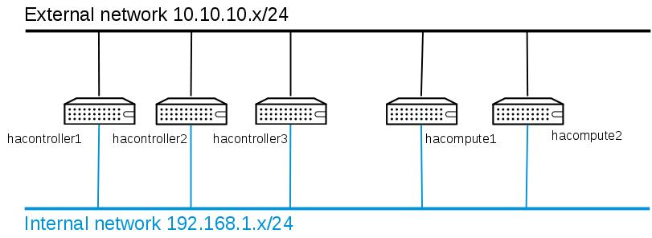

Introduction
------------

Controller nodes will run all OpenStack services in this architecture, while compute nodes will only act as hypervisors.

Environment description
-----------------------

### Network setup

The basic requirements for this environment include 5 nodes, with the network setup described in the following diagram:

-   The external network is used by the Neutron floating IPs, and for any external access. The hypervisor nodes (hacompute1 and hacompute2) do not need to be connected to this network, but in the demo setup they are connected for testing purposes.
-   The internal network will carry all other traffic: API traffic, tenant networks and storage traffic.

Please note this is a minimum test setup. Any production setup should separate internal and external API traffic, tenant networks and storage traffic in different network segments.

### Node setup

The following table provides the system details for the environment used during testing.

|     Hostname       | NIC 1 | NIC 2 | Disk 1 | Disk 2 |
|--------------------|--------------------------------------|-------------------|------------------|-----------------|
|hacontroller1       |eth0: no IP, used for provider network|eth1: 192.168.1.221| 60 GB (/dev/vda) | 8 GB (/dev/vdb) |
|hacontroller2       |eth0: no IP, used for provider network|eth1: 192.168.1.222| 60 GB (/dev/vda) | 8 GB (/dev/vdb) |
|hacontroller3       |eth0: no IP, used for provider network|eth1: 192.168.1.223| 60 GB (/dev/vda) | 8 GB (/dev/vdb) |
|controller-vip (virtual hostname)|                         |eth1: 192.168.1.220|                  |                 |
|hacompute1          |eth0: 10.10.10.224 (-priv)            |eth1: 192.168.1.224| 60 GB (/dev/vda) |                 |
|hacompute2          |eth0: 10.10.10.225 (-priv)            |eth1: 192.168.1.225| 60 GB (/dev/vda) |                 |

All nodes have SELinux set to *Enforcing* and an active firewall.

On the detailed installation notes, remember to substitute any occurrence of 192.168.1.22X with the IP of the node being configured.

#### Single vs multiple VIPs

Please note that the current document uses a single virtual IP for the whole stack of OpenStack API services. It is also possible to use multiple virtual IPs, one per API service. Using multiple virtual IPs will allow for load distribution between the three HAProxy instances. In contrast, the requirements for available IP addresses increase, and the initial configuration can be slightly more complex if performed manually.

#### Base operating system installation

All nodes start from a *minimal* CentOS 7 or RHEL 7 installation, then running the enabling the required software channels.

-   For RDO Juno, follow the steps specified in the [RDO wiki](https://openstack.redhat.com/Repositories)
-   For the [Red Hat Enterprise Linux OpenStack Platform](http://www.redhat.com/openstack), run the following commands to enable the required repositories:

    subscription-manager register --username=${RHSMUSER} --password=${RHSMPASS} 
    subscription-manager attach --auto
    subscription-manager repos --disable \* 
    subscription-manager repos --enable rhel-7-server-rpms 
    subscription-manager repos --enable rhel-7-server-rh-common-rpms 
    subscription-manager repos --enable rhel-7-server-openstack-6.0-rpms
    yum -y update 
    reboot

The systems also had NetworkManager disabled:

    systemctl disable NetworkManager
    systemctl enable network

If the installed system cannot access the gateway, be sure there is a “GATEWAY=xxx” entry in the relevant ifcfg file:

    NAME=eth0
    ...
    GATEWAY=192.168.1.1

**Note:** It is very important to make sure that NTP is correctly configured on all nodes. Failure to do so can cause environment instability.

#### Configuration steps

**NOTE:** before moving on, please remember that the following instructions have been created for the above-mentioned scenario (3 controller nodes, with a specific network setup). If you are using this guide to implement your own environment, pay close attention to any IP substitution and other changes that may apply to your environment. Also, do not forget to set sensible passwords.

The configuration steps can be divided into:

-   Installing/configuring/enabling all core non-Openstack services
    -   [HAProxy](haproxy-config.md)
    -   [Galera](galera-config.md)
    -   [RabbitMQ](rabbitmq-config.md)
    -   [Memcached](memcached-config.md)
    -   [Redis](redis-config.md)
    -   [MongoDB](mongodb-config.md)
    -   [Keepalived](keepalived-config.md)
-   Installing/configuring/enabling all core Openstack services
    -   [Keystone](keystone-config.md)
    -   [Glance](glance-config.md)
    -   [Cinder](cinder-config.md)
    -   [Swift](swift-config.md)
    -   [Neutron](neutron-config.md)
    -   [Nova](nova-config.md)
    -   [Ceilometer](ceilometer-config.md)
    -   [Heat](heat-config.md)
    -   [Horizon](horizon-config.md)
