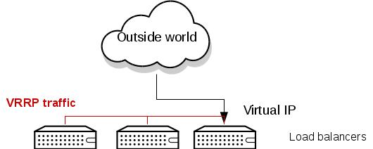

Introduction
------------

[Keepalived](http://www.keepalived.org/) provides simple and robust facilities for load balancing and high-availability to Linux system and Linux based infrastructures. In this highly available OpenStack architecture, it is used to provide high availability to the virtual IP(s) used by HAProxy. High-availability is achieved by VRRP protocol, a fundamental brick for router failover.

The following commands will be executed on all controller nodes, unless otherwise stated.

Install software
----------------

    yum -y install keepalived psmisc

**Note:** keepalived \>= 1.2.13 is required to avoid bugs in the L3 HA setup (see [this bug](https://bugzilla.redhat.com/show_bug.cgi?id=1187500) for details). This package is planned to be available in Red Hat Enterprise Linux 7.1 and CentOS 7.1.

Create configuration file
-------------------------

On all nodes:

    cat > /etc/keepalived/keepalived.conf << EOF

    vrrp_script chk_haproxy {
        script "/usr/bin/killall -0 haproxy"
        interval 2
    }

    vrrp_instance VI_PUBLIC {
        interface eth1
        state BACKUP
        virtual_router_id 52
        priority 101
        virtual_ipaddress {
            192.168.1.220 dev eth1
        }
        track_script {
            chk_haproxy
        }
    }

    vrrp_sync_group VG1
        group {
            VI_PUBLIC
        }
    EOF

Set priority for nodes 2 and 3
------------------------------

On node 2:

    sed --in-place 's/priority 101/priority 102/g' /etc/keepalived/keepalived.conf

On node 3:

    sed --in-place 's/priority 101/priority 103/g' /etc/keepalived/keepalived.conf

Open firewall rules and start services
--------------------------------------

On all nodes:

    firewall-cmd --direct --add-rule ipv4 filter INPUT 0 -i eth1 -d 224.0.0.0/8 -j ACCEPT
    firewall-cmd --direct --perm --add-rule ipv4 filter INPUT 0 -i eth1 -d 224.0.0.0/8 -j ACCEPT
    systemctl start keepalived
    systemctl enable keepalived
