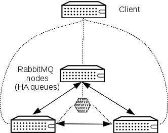

Introduction
------------

RabbitMQ can create a native cluster, by grouping several nodes and replicating all message queues. Clustered RabbitMQ environments tolerate the failure of individual nodes. Nodes can be started and stopped at will.

**Note:** Access to RabbitMQ is not handled by HAproxy, as there are known issues integrating RabbitMQ with HAProxy. Instead consumers must be supplied with the full list of hosts running RabbitMQ with `rabbit_hosts` and `rabbit_ha_queues` options, and connect directly to one or more RabbitMQ servers. Reconnections in case of a node failure are handled automatically.

The following commands will be executed on all controller nodes, unless stated otherwise.

Install package
---------------

    yum -y install rabbitmq-server

Create erlang cookie and distribute
-----------------------------------

**On node 1:**

    cat > /etc/rabbitmq/rabbitmq-env.conf << EOF
    NODE_IP_ADDRESS=192.168.1.221
    EOF

    systemctl start rabbitmq-server
    systemctl stop rabbitmq-server
    scp -p /var/lib/rabbitmq/.erlang.cookie hacontroller2:/var/lib/rabbitmq
    scp -p /var/lib/rabbitmq/.erlang.cookie hacontroller3:/var/lib/rabbitmq

Set permissions for erlang cookie
---------------------------------

**On node 2 and node 3:**

    chown rabbitmq:rabbitmq /var/lib/rabbitmq/.erlang.cookie

    cat > /etc/rabbitmq/rabbitmq-env.conf << EOF
    NODE_IP_ADDRESS=192.168.1.22X
    EOF

### Create rabbitmq configuration

**On all nodes:**

    cat > /etc/rabbitmq/rabbitmq.config << EOF

    [
        {rabbit, [
        {cluster_nodes, {['rabbit@hacontroller1', 'rabbit@hacontroller2', 'rabbit@hacontroller3'], disc}},
        {cluster_partition_handling, ignore},
        {default_user, <<"guest">>},
        {default_pass, <<"guest">>},
        {tcp_listen_options, [binary,
            {packet, raw},
            {reuseaddr, true},
            {backlog, 128},
            {nodelay, true},
            {exit_on_close, false},
            {keepalive, true}]}
        ]},
        {kernel, [
            {inet_dist_listen_max, 44001},
            {inet_dist_listen_min, 44001}
        ]}
    ].

    EOF

Set kernel TCP keepalive parameters
-----------------------------------

    cat > /etc/sysctl.d/tcpka.conf << EOF
    net.ipv4.tcp_keepalive_intvl = 1
    net.ipv4.tcp_keepalive_probes = 5
    net.ipv4.tcp_keepalive_time = 5
    EOF

    sysctl -p /etc/sysctl.d/tcpka.conf

Start services and open firewall ports
--------------------------------------

    firewall-cmd --add-port=5672/tcp 
    firewall-cmd --add-port=4369/tcp
    firewall-cmd --add-port=5672/tcp --permanent
    firewall-cmd --add-port=4369/tcp --permanent
    firewall-cmd --add-port=44001/tcp
    firewall-cmd --add-port=44001/tcp --permanent
    systemctl enable rabbitmq-server
    systemctl start rabbitmq-server

And check everything is going fine by running:

<pre> # rabbitmqctl cluster_status

Cluster status of node rabbit@hacontroller1 ...
[{nodes,[{disc,[rabbit@hacontroller1,rabbit@hacontroller2,
rabbit@hacontroller3]}]},
{running_nodes,[rabbit@hacontroller3,rabbit@hacontroller2,
rabbit@hacontroller1]},
{cluster_name,<<"rabbit@hacontroller1.example.com">\>}, {partitions,[]}]

...done.

</pre>
Set HA mode for all queues
--------------------------

**On node 1:**

    rabbitmqctl set_policy HA '^(?!amq\.).*' '{"ha-mode": "all"}'
